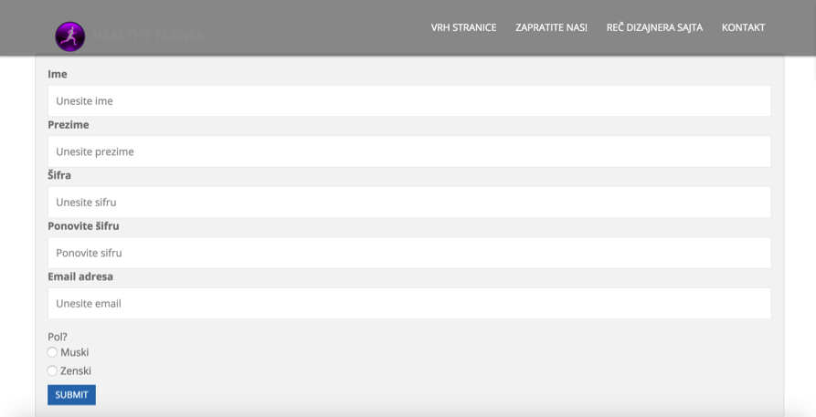
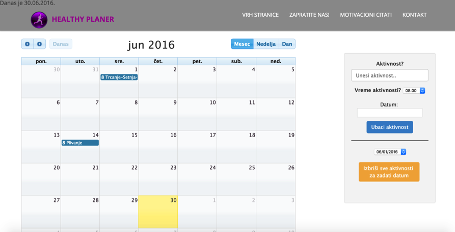
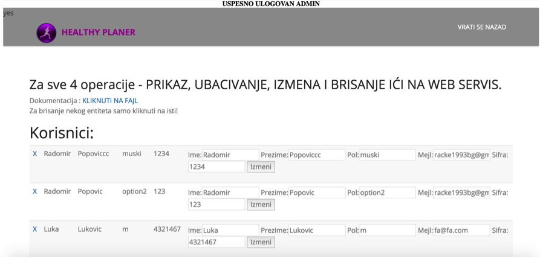

# Healthy-Planner
Web application which provides several functionalities to end users such as: Using calendar for organizing their activities, and also to inform theirselves about sport institutions that provide all kinds of activities in Belgrade, Serbia (gyms, pools, parks).

Based on location of an end user, 3 fastest routes are being auto generated to the closest gym, park or pool.

Application has a back end part also for the administrator, who can use 4 CRUD commands for manipulating database. 

Application also containts implements web service. A detailed instruction (in Serbian) is written in file DokumentacijaITEHProjekat.docx. Result is being returned in JSON format

*Note - for using this app, database parameters needs to be changed. 

Screenshots of the application :  

